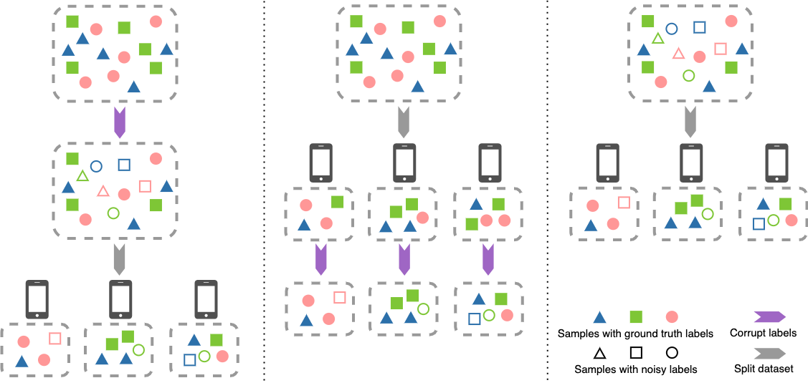

# FedNoisy

Benchmark for federated noisy label learning


[toc]

## Environment requirements

Pytorch installation via `conda`:

```bash
$ conda install pytorch==1.8.0 torchvision==0.9.0 torchaudio==0.8.0 cudatoolkit=11.1 -c pytorch -c nvidia -y
```

Extra dependencies:
```bash
$ pip install -r requirements.txt
```


## Federated Noisy Labe Settings

Current supported datasets:
<table>
	<tbody>
		<tr >
			<th style="text-align: left; vertical-align: middle;">Noise Scene</th>
			<th style="text-align: left; vertical-align: middle;">Dataset</th>
			<th style="text-align: left; vertical-align: middle;">#Train</th>
			<th style="text-align: left; vertical-align: middle;">#Validation</th>
			<th style="text-align: left; vertical-align: middle;">#Test</th>
			<th style="text-align: left; vertical-align: middle;">#Class</th>
			<th style="text-align: left; vertical-align: middle;">ImageSize</th>
			<th style="text-align: left; vertical-align: middle;">Noise Ratio (%)</th>
		</tr>
		<tr >
			<td style="vertical-align: middle;" rowspan="4">
				<p>Globalized</p>
				<p>&amp;</p>
				<p>Localized</p>
			</td>
			<td style="text-align: left; vertical-align: middle;">MNIST</td>
			<td>60K</td>
			<td>N/A</td>
			<td>10K</td>
			<td>10</td>
			<td>28&times;28</td>
			<td>N/A</td>
		</tr>
		<tr >
			<td style="text-align: left; vertical-align: middle;">SVHN</td>
			<td>73K</td>
			<td>N/A</td>
			<td>26K</td>
			<td>10</td>
			<td>32&times;32&times;3</td>
			<td>N/A</td>
		</tr>
		<tr >
			<td style="text-align: left; vertical-align: middle;">CIFAR-10</td>
			<td>50K</td>
			<td>N/A</td>
			<td>10K</td>
			<td>10</td>
			<td>32&times;32&times;3</td>
			<td>N/A</td>
		</tr>
		<tr >
			<td style="text-align: center; vertical-align: middle;">CIFAR-100</td>
			<td>50K</td>
			<td>N/A</td>
			<td>10K</td>
			<td>100</td>
			<td>32&times;32&times;3</td>
			<td>N/A</td>
		</tr>
		<tr >
			<td style="text-align: center; vertical-align: middle;" rowspan="2">Real-world</td>
			<td style="text-align: center; vertical-align: middle;">Clothing1M</td>
			<td>1M</td>
			<td>14K</td>
			<td>10K</td>
			<td>14</td>
			<td>224&times;224&times;3</td>
			<td>&asymp;39.46</td>
		</tr>
		<tr >
			<td>WebVision</td>
			<td>2.4M</td>
			<td>50K</td>
			<td>50K</td>
			<td>1000</td>
			<td>256&times;256&times;3</td>
			<td>&asymp;20.00</td>
		</tr>
	</tbody>
</table>


Federated noise scenes provided in $\texttt{FedNoisy}$ is shown as below. (Left: _globalized noise_; middle: _localized noise_; right: _real-word noise_. Globalized noise follows a constant noise ratio $\varepsilon_{global}$ in label corruption, while localized noise draws localized noise ratio $\varepsilon_{k}$ from a uniform distribution on each client $k$.)




### Build dataset with noisy labels

The basic command usage is

```bash
python build_dataset_fed.py --dataset cifar10 \
     --partition iid \
     --num_clients 10 \
     --globalize \
     --noise_mode clean \
     --raw_data_dir ../rawdata/cifar10 \
     --data_dir ../fedNLLdata/cifar10 \
     --seed 1
```


#### Noise related setting

- Clean: `--globalize --noise_mode clean` for data setting without noise
- Globalized noise
  - `--globalize --noise_ratio 0.4 --noise_mode sym` for globalized symmetric noise $\varepsilon_{global}=0.4$
  - `--globalize --noise_ratio 0.4 --noise_mode asym` for globalized asymmetric noise $\varepsilon_{global}=0.4$
- Localized noise 
  - `--min_noise_ratio 0.3 --max_noise_ratio 0.5 --noise_mode sym` for localized symmetric noise $\varepsilon_k \sim \mathcal{U}(0.3, 0.5)$
  - `--min_noise_ratio 0.3 --max_noise_ratio 0.5 --noise_mode asym` for localized asymmetric noise $\varepsilon_k \sim \mathcal{U}(0.3, 0.5)$


#### Dataset partition setting

- MNIST: `--dataset mnist`

  - IID: `--partition iid --num_clients 10`
  - Non-IID quantity skew: `--partition noniid-quantity --num_clients 10 --dir_alpha 0.1`
  - Non-IID Dirichlet-based label skew: `--partition noniid-labeldir --dir_alpha 0.1 --num_clients 10`
  - Non-IID quantity-based label skew: `--partition noniid-#label --major_classes_num 3 --num_clients 10`

- SVHN: `--dataset svhn`

- CIFAR-10: `--dataset cifar10`

- CIFAR-100:  `--dataset cifar100`


### Algorithms

<table style="margin-left: auto; margin-right: auto;">
<tbody>
<tr>
<td  rowspan="2"><strong>Federated Algorithm</strong></td>
<td  colspan="2"><strong>Noisy Label Algorithm</strong></td>
<td  rowspan="2"><strong>Paper</strong></td>
</tr>
<tr>
<td><em>Category</em></td>
<td><em>Method</em></td>
</tr>
<tr>
<td  rowspan="8">FedAvg</td>
<td>Robust Regularizaiton</td>
<td>Mixup</td>
<td><a href="https://arxiv.org/abs/1710.09412" target="_blank">[2018 ICLR] Mixup: Beyond empirical risk minimization</a></td>
</tr>
<tr>
<td  rowspan="3">RobustLoss Function</td>
<td>SCE</td>
<td><a href="https://openaccess.thecvf.com/content_ICCV_2019/papers/Wang_Symmetric_Cross_Entropy_for_Robust_Learning_With_Noisy_Labels_ICCV_2019_paper.pdf" target="_blank">[2019 ICCV] Symmetric Cross Entropy for Robust Learning with Noisy Labels</a></td>
</tr>
<tr>
<td>GCE</td>
<td><a href="https://proceedings.neurips.cc/paper/2018/hash/f2925f97bc13ad2852a7a551802feea0-Abstract.html" target="_blank">[2018 NeurIPS] Generalized Cross Entropy Loss for Training Deep Neural Networks with Noisy Labels</a></td>
</tr>
<tr>
<td>MAE</td>
<td><a href="https://arxiv.org/abs/1712.09482" target="_blank">[2017 AAAI] Robust Loss Functions under Label Noise for Deep Neural Networks</a></td>
</tr>
<tr>
<td  rowspan="3">Loss Adjustment</td>
<td>M-DYR-H</td>
<td><a href="http://proceedings.mlr.press/v97/arazo19a/arazo19a.pdf" target="_blank">[2019 ICML] Unsupervised Label Noise Modeling and Loss Correction</a></td>
</tr>
<tr>
<td>M-DYR-S</td>
<td><a href="http://proceedings.mlr.press/v97/arazo19a/arazo19a.pdf" target="_blank">[2019 ICML] Unsupervised Label Noise Modeling and Loss Correction</a></td>
</tr>
<tr>
<td>DM-DYR-SH</td>
<td><a href="http://proceedings.mlr.press/v97/arazo19a/arazo19a.pdf" target="_blank">[2019 ICML] Unsupervised Label Noise Modeling and Loss Correction</a></td>
</tr>
<tr>
<td>Sample Selection</td>
<td>Co-teaching</td>
<td><a href="https://arxiv.org/abs/1804.06872" target="_blank">[2018 NeurIPS] Co-teaching: Robust Training of Deep Neural Networks with Extremely Noisy Labels</a></td>
</tr>
</tbody>
</table>


- __FedAvg__

  - Vanilla FedAvg

    ```bash
    $ python python fednoisy/algorithms/fedavg/main.py --dataset mnist \
        --model SimpleCNN \
        --partition iid \
        --num_clients 10 \
        --globalize \
        --noise_mode sym \
        --noise_ratio 0.4 \
        --seed 1 \
        --sample_ratio 1.0 \
        --com_round 500 \
        --epochs 5 \
        --momentum 0.9 \
        --lr 0.01 \
        --weight_decay 0.0005 \
        --data_dir ../fedNLLdata/mnist \
        --out_dir ../Fed-Noisy-checkpoint/mnist/
    ```
  
  - FedAvg + Symmetric Cross Entropy
  
    ```bash
    $ python fednoisy/algorithms/fedavg/main.py --dataset mnist \
        --model SimpleCNN \
        --partition iid \
        --num_clients 10 \
        --globalize \
        --noise_mode sym \
        --noise_ratio 0.4 \
        --data_dir ../fedNLLdata/mnist \
        --out_dir ../Fed-Noisy-checkpoint/mnist/ \
        --com_round 500 \
        --epochs 5 \
        --sample_ratio 1.0 \
        --lr 0.01 \
        --momentum 0.9 \
        --weight_decay 0.0005 \
        --criterion sce \
        --sce_alpha 0.01 \
        --sce_beta 1.0 \
        --seed 1
    ```
  
  - FedAvg + DM-DYR-SH
  
    ```bash
    $ python fednoisy/algorithms/fedavg/main.py --dataset mnist \
        --model SimpleCNN \
        --partition iid \
        --num_clients 10 \
        --globalize \
        --noise_mode sym \
        --noise_ratio 0.4 \
        --data_dir ../fedNLLdata/mnist \
        --out_dir ../Fed-Noisy-checkpoint/mnist/ \
        --com_round 500 \
        --epochs 5 \
        --sample_ratio 1.0 \
        --lr 0.01 \
        --momentum 0.9 \
        --weight_decay 1e-4 \
        --dynboot \
        --dynboot_alpha 32 \
        --dynboot_mixup dynamic \
        --dynboot_reg 1.0 \
        --seed 1
    ```
  
  - FedAvg + Mixup
  
    ```bash
    $ python fednoisy/algorithms/fedavg/main.py --dataset mnist \
        --model SimpleCNN \
        --partition iid \
        --num_clients 10 \
        --globalize \
        --noise_mode sym \
        --noise_ratio 0.4 \
        --data_dir ../fedNLLdata/mnist \
        --out_dir ../Fed-Noisy-checkpoint/mnist/ \
        --com_round 500 \
        --epochs 5 \
        --sample_ratio 1.0 \
        --lr 0.01 \
        --momentum 0.9 \
        --weight_decay 5e-4 \
        --mixup \
        --mixup_alpha 1.0 \
        --seed 1
    ```
  
  - FedAvg + Co-teaching
  
    ```bash
    $ python fednoisy/algorithms/fedavg/main.py --dataset mnist \
        --model SimpleCNN \
        --partition iid \
        --num_clients 10 \
        --globalize \
        --noise_mode sym \
        --noise_ratio 0.4 \
        --data_dir ../fedNLLdata/mnist  \
        --out_dir ../Fed-Noisy-checkpoint/mnist/ \
        --com_round 500 \
        --epochs 5 \
        --sample_ratio 1.0 \
        --lr 0.01 \
        --momentum 0.9 \
        --weight_decay 5e-4 \
        --coteaching \
        --coteaching_forget_rate 0.4 \  # depends on noise ratio, possible value can be noise ratio it self 
        --coteaching_num_gradual 25 \  # default setting is 10 for 200 epochs, here we set similar ratio with number of global round
        --seed 1
    ```
  
    

For more scripts, please check [scripts](./scripts/) folder.


## References

<a id="1">[1]</a> LeCun, Y. (1998). The MNIST database of handwritten digits. http://yann.lecun.com/exdb/mnist/.

<a id="2">[2]</a> Krizhevsky, A., & Hinton, G. (2009). Learning multiple layers of features from tiny images.

<a id="3">[3]</a> Netzer, Y., Wang, T., Coates, A., Bissacco, A., Wu, B., & Ng, A. Y. (2011). Reading digits in natural images with unsupervised feature learning.

<a id="4">[4]</a> Xiao, T., Xia, T., Yang, Y., Huang, C., & Wang, X. (2015). Learning from massive noisy labeled data for image classification. In Proceedings of the IEEE conference on computer vision and pattern recognition (pp. 2691-2699).

<a id="5">[5]</a> Li, W., Wang, L., Li, W., Agustsson, E., & Van Gool, L. (2017). Webvision database: Visual learning and understanding from web data. arXiv preprint arXiv:1708.02862.

<a id="6">[6]</a> xxx